# ChamberFlux V2 Fan Module

**A compact, adjustable chamber-circulation module for enclosed FDM printers**

ChamberFlux V2 is designed to improve bulk air transport inside printer enclosures, extend the effective reach of existing filtration systems, reduce stagnant regions, and support post-print chamber purging.

  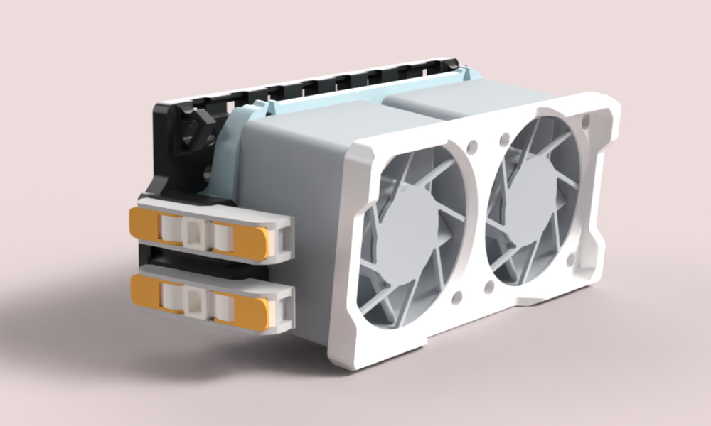
  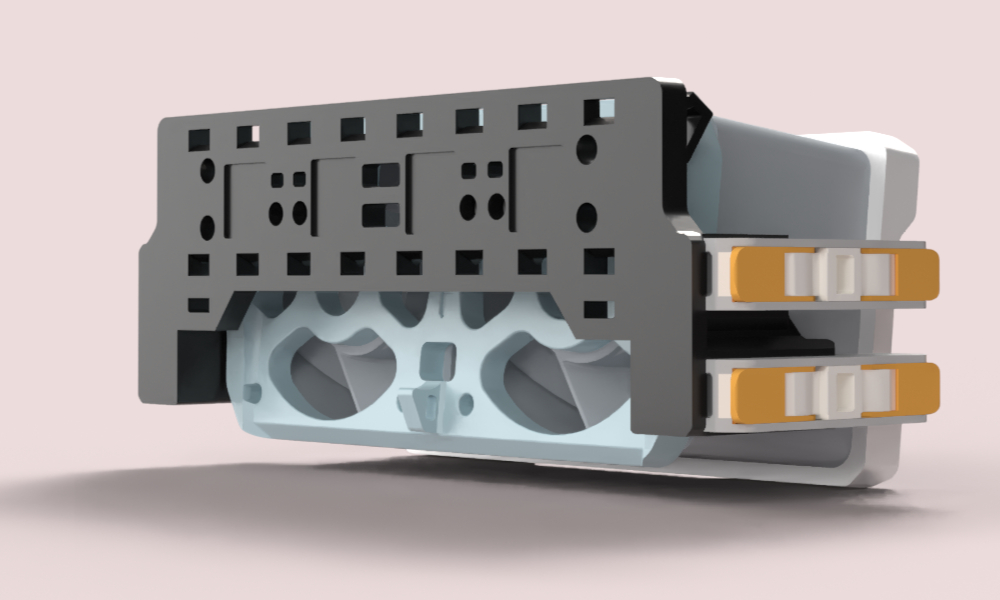

> [Download the printable files on Printables](PRINTABLES_LINK_HERE)

---

## About ChamberFlux

ChamberFlux is a compact, low-complexity chamber-circulation module created to improve air transport inside enclosed 3D printers and help existing filtration systems operate more effectively.

It is designed to integrate with the filter already installed in your printer rather than replace it. The module uses two high-airflow axial fans to move air through regions that may otherwise remain stagnant or poorly connected to the filter intake.

ChamberFlux:

* improves air transport toward an existing filter;
* reducing stagnant air regions;
* supports low speed mixing;
* maintains even chamber temperature 

The design uses common 40 mm fans and minimal hardware. It supports several mounting methods, multiple pivot positions, left- or right-side wiring, and both horizontal and vertical installation.

---

## Why This Exists

Compact printer filters must push air through restrictive media such as activated carbon, carbon pellets, foam, or HEPA elements. Doing this requires fans with sufficient static pressure.

That creates an unavoidable engineering tradeoff:

* denser or larger filter media improves filtration capacity;
* increased resistance reduces total airflow;
* reduced airflow can limit how much of the chamber air reaches the filter;
* circulation may remain concentrated near the filter while distant regions remain poorly mixed.

This effect can be especially important for compact filter systems. A filter may process the air immediately surrounding its intake repeatedly while contaminants in upper corners, opposite walls, or other stagnant regions reach the filter much more slowly.

Adding more carbon increases adsorption capacity, but it does not automatically ensure that contaminated air reaches that carbon during the duration of a print.

ChamberFlux addresses the transport side of the problem.

The axial fans operate against very little resistance, allowing them to move a relatively large volume of chamber air. They are not intended to push air through filter media. Instead, they circulate bulk chamber air toward the working region of the existing filter.

ChamberFlux does not change the filter’s intrinsic single-pass removal efficiency. It is intended to improve the frequency with which chamber air reaches the filter, increasing effective chamber-scale removal without requiring a second carbon cartridge or a complete filtration-system replacement.

---

## Controlled Test Results

ChamberFlux was developed from a controlled study investigating the effects of activated-carbon mass and active chamber recirculation on VOC-related sensor response.

The experiment used:

* an approximately 8 L sealed chamber;
* fixed ABS extrusion;
* a Nevermore Micro v5-style activated-carbon filter;
* two SGP41 comparative VOC sensor channels;
* one BME688 environmental sensor;
* five treatment conditions;
* four trials per condition;
* 900 seconds of ABS extrusion followed by 300 seconds of recovery monitoring.

The key engineering comparison was between:

* **30 g activated carbon with ChamberFlux-style active recirculation**
* **60 g activated carbon without separate chamber recirculation**

Despite using half the activated-carbon mass, the actively recirculated 30 g condition produced lower mean VOC-related sensor response in several measured metrics.

| Metric                       |               30 g active |          60 g passive |
| ---------------------------- | ------------------------: | --------------------: |
| SGP41 response at 900 s      |   **1.30 ± 0.21 log₂-eq** |   1.43 ± 0.20 log₂-eq |
| Cumulative response, 0–900 s | **15.98 ± 3.14 log₂-min** | 18.19 ± 3.54 log₂-min |
| Mean sensor heterogeneity    |           **0.08 ± 0.06** |           0.12 ± 0.10 |

These results indicate that chamber-scale air transport can be an important filtration constraint alongside carbon quantity.

  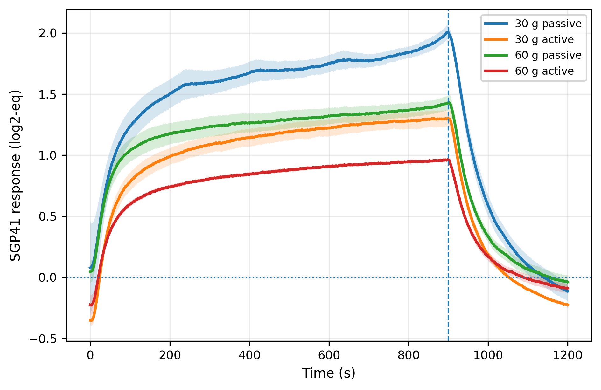
  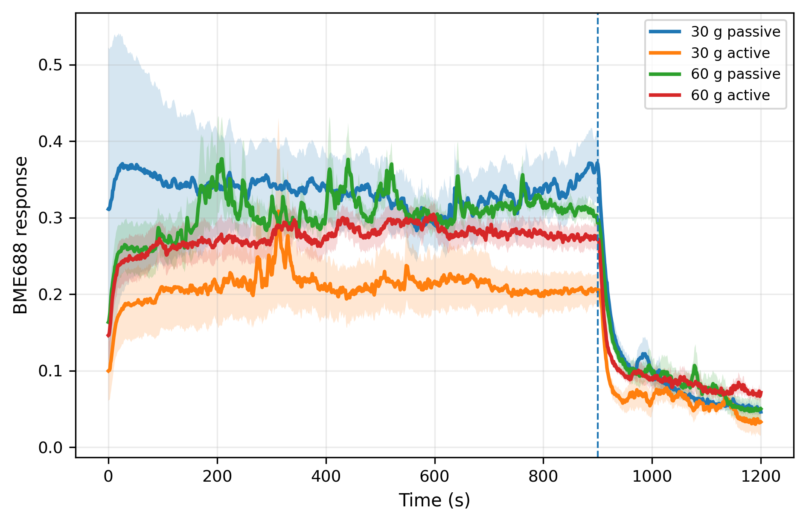
  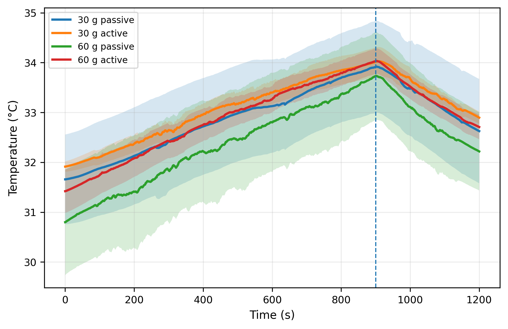

### Important limitations

These results were obtained in one controlled chamber geometry using comparative metal-oxide gas sensors.

They should not be interpreted as:

* absolute VOC concentration measurements;
* proof that every printer will produce the same improvement;
* a guarantee that 30 g active will always outperform 60 g passive;
* evidence that the enclosure is safe to occupy or open;
* a replacement for ventilation or appropriate material-handling practices.

ChamberFlux should be independently evaluated in different printer geometries, filter arrangements, and operating modes.

---

## Hardware Features

### Compact dual-fan design

The assembled module has an approximate maximum footprint of:

**107 × 52 × 44 mm**

This includes the mounting base, pivoting fan carrier, and two 40 mm axial fans.

The rear of the fan assembly maintains open clearance so that the fan inlets are not pressed directly against the mounting surface.

### Universal mounting base

The mounting base supports several installation methods:

* M3 screws into T-slot extrusion hardware;
* integrated zip-tie mounting points;
* dedicated VHB mounting surface;
* optional press-fit magnet mounting;
* horizontal mounting;
* vertical mounting;
* inverted mounting.

### Adjustable pivoting fan carrier

The fan carrier can be aimed to suit the enclosure layout.

Features include:

* four available pivot mounting positions;
* M3 screw-joint adjustment;
* captive M3 hex-nut version;
* M3 heat-set-insert version;
* adjustable fan angle;
* compatibility with several mounting orientations;
* optional front fan cover.

The multiple pivot positions allow the user to prioritize clearance, wiring access, mounting orientation, or airflow direction.

### Flexible wiring

ChamberFlux includes:

* left- or right-side wiring exits;
* integrated wire channels;
* printed wire guides;
* strain-relief and zip-tie points;
* optional locking mounts for WAGO 221-2401 connectors.

The WAGO system is optional. The fans may be connected using any correctly rated and insulated wiring method.

### High-airflow axial fans

ChamberFlux is designed around 40 mm axial fans.

Axial fans generally provide high unrestricted airflow but relatively low static pressure. This makes them appropriate for bulk chamber circulation because ChamberFlux does not place carbon, HEPA media, or another major restriction directly in the fan path.

The exact result will depend on:

* fan model;
* fan thickness;
* operating voltage;
* PWM duty cycle;
* mounting location;
* chamber geometry;
* filter location.

### Printable design

The printed components are designed to be:

* support-free;
* lightweight;
* easy to orient;
* compatible with common FDM printers;
* dimensionally compensated for practical assembly;
* serviceable without replacing the complete system.

  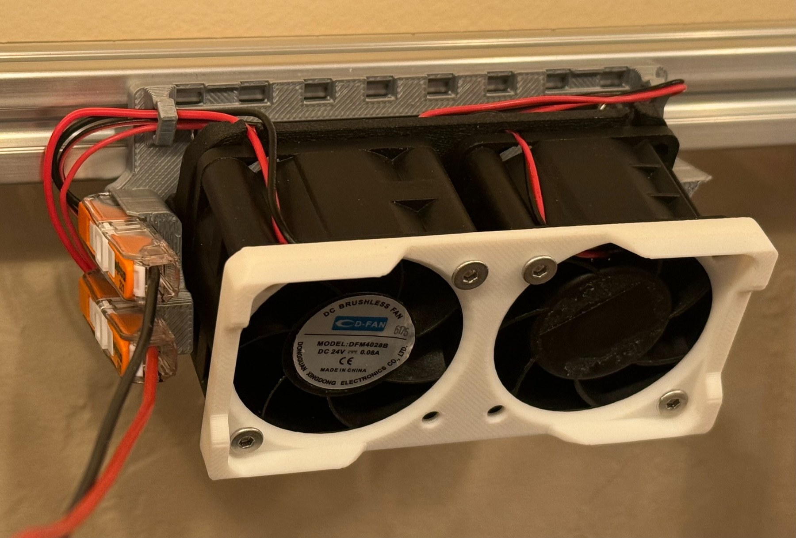
  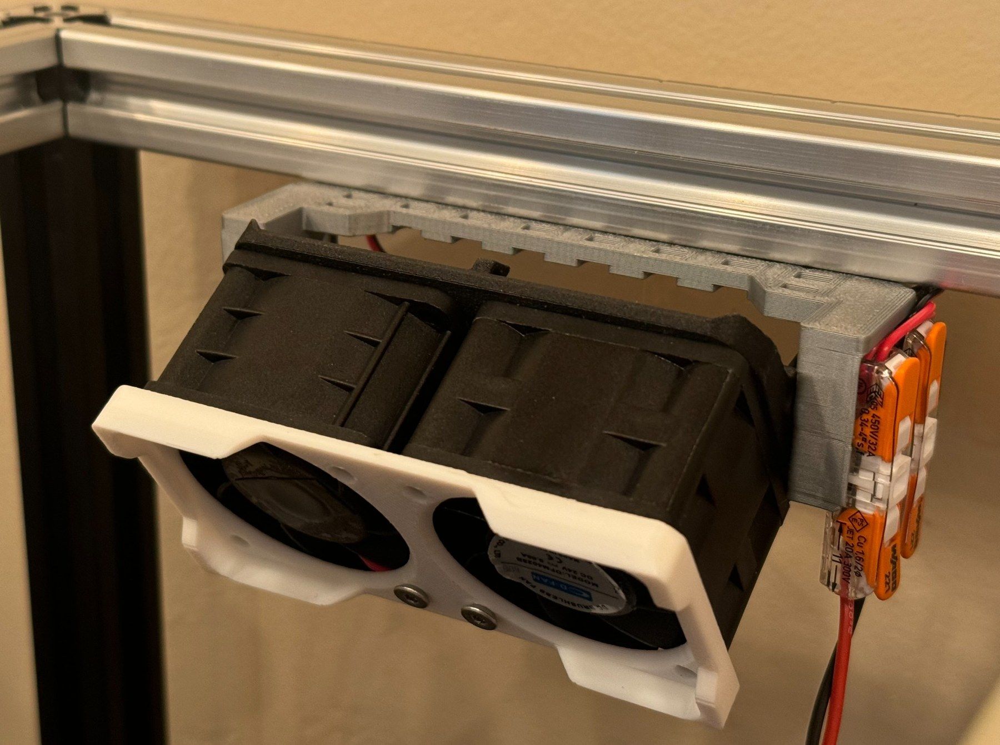

---

## Parts and Bill of Materials

### Printed parts

The standard ChamberFlux assembly consists of:

1. **Universal mounting base**
2. **Pivoting dual-fan carrier**
3. **Optional front fan cover**

Two pivot-carrier versions are available:

* captive M3 hex-nut version;
* M3 heat-set-insert version.

Printable files and print profiles are hosted on Printables:

> [Download ChamberFlux V2 on Printables](PRINTABLES_LINK_HERE)

### Required hardware

| Part                     | Quantity | Notes                                                                       |
| ------------------------ | -------: | --------------------------------------------------------------------------- |
| 40xx axial fans          |        2 | 4010, 4020, 4028, or another compatible 40 mm fan                           |
| M3×6 mm or longer screws |        4 | Used for pivot/base attachment; exact length depends on configuration       |
| M3 hex nuts              |        2 | Required for the hex-nut pivot version                                      |
| M3 heat-set inserts      |        2 | Used instead of hex nuts for the heat-set version                           |
| M3 fan screws            |        4 | Length depends on fan thickness and whether the optional cover is installed |

For 4028 fans with the optional front cover, use approximately:

**M3×35 mm or longer**

Always verify the required screw length against the specific fan model before assembly.

### Optional hardware

| Part                     |  Quantity | Purpose                      |
| ------------------------ | --------: | ---------------------------- |
| WAGO 221-2401 connectors |         2 | Clean removable fan wiring   |
| VHB tape                 | As needed | Panel mounting               |
| Magnets                  | As needed | Magnetic mounting            |
| Zip ties                 | As needed | Mounting and wire management |
| T-slot nuts              | As needed | Aluminum-extrusion mounting  |
| External PWM controller  |         1 | Optional fan-speed control   |

### Suggested high-airflow fans

Any compatible 40 mm fan may be used. Fans already available from other printer projects may work.

Examples of dedicated high-airflow 4028 options include:

* [Voxel PLA 4028 High-Flow Fan Upgrades](https://voxelpla.com/products/4028-high-flow-fans-upgrades)
* [Delta FFB0412SHN 4028 Axial Fan](https://central3dprinting.com/products/delta-4028-12v-0-6a-axial-fan-ffb0412shn-2-pin-4-pin-pwm)

These links are examples only and are not sponsorships or required components.

### Electrical warning

Verify fan voltage before connecting power.

Do not connect:

* 12 V fans directly to a 24 V output;
* fans to an output that cannot provide the required current;
* exposed or uninsulated conductors inside the enclosure.

Disconnect printer power before performing wiring work.

---

## Files

To centralize public download statistics, printable release files are hosted on Printables.

The Printables release includes:

* STL files;
* print-ready 3MF files;
* available STEP files;
* part variants;
* recommended print orientation;
* slicer profiles where available.

> **[Download ChamberFlux V2](PRINTABLES_LINK_HERE)**

This GitHub repository contains:

* project documentation;
* controlled test figures;
* assembly instructions;
* compatibility information;
* revision history;
* source links;
* issue tracking.

Editable Onshape source:

> [Open the ChamberFlux Onshape document](ONSHAPE_LINK_HERE)

---

## Assembly Instructions

### Step 1 — Install the fans and optional cover

Place both fans into the pivoting fan carrier.

If using the optional front cover:

1. Insert the four M3 screws through the front cover.
2. Align the screws with the fan mounting holes.
3. Thread the screws into the printed fan carrier.
4. Tighten only until the assembly is secure.

Do not overtighten the screws or crush the fan frames.

  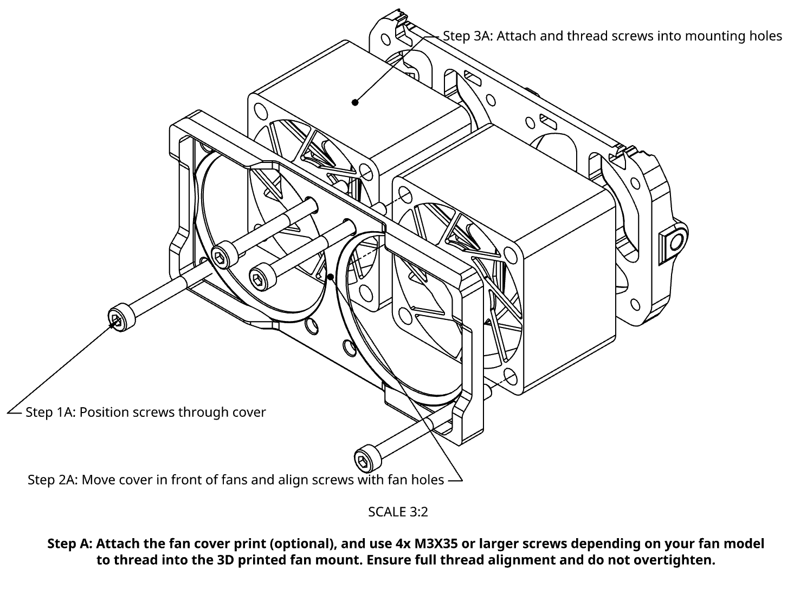

### Step 2 — Install the pivot hardware

1. Insert an M3 hex nut into each captive nut pocket, or install the M3 heat-set inserts.
2. Select the preferred pivot mounting position.
3. Align the fan carrier with the selected holes.
4. Insert the M3 screws.
5. Tighten the screws until the selected angle is held securely.

  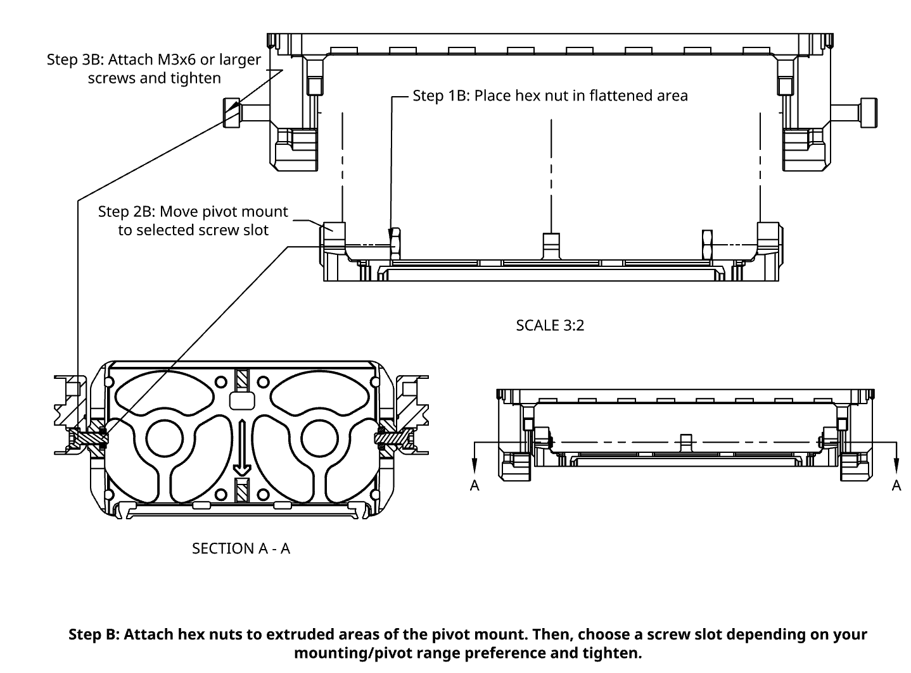

### Step 3 — Route and connect the wiring

1. Choose the left or right wiring exit.
2. Route the fan leads through the integrated wire guides.
3. Connect the fan leads using the desired wiring method.
4. If using WAGO 221-2401 connectors, attach both sides of the wiring before sliding the connectors into the locking mounts.
5. Connect the assembly to a correctly rated power source or printer-board output.

  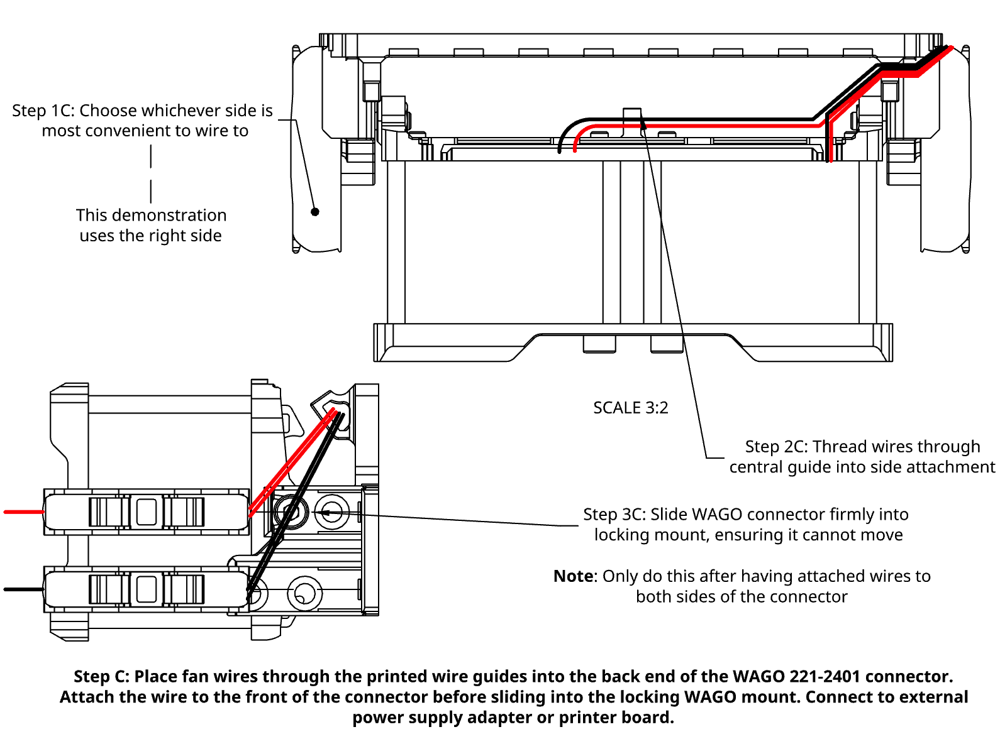

---

## Installation and Compatibility

ChamberFlux is intended for enclosed FDM printers with:

* localized activated-carbon filtration;
* HEPA filtration;
* weak chamber-scale circulation;
* stagnant upper or corner regions;
* DIY or extrusion-frame enclosures;
* insufficient post-print purge airflow.

It may provide less benefit on printers that already have strong and well-distributed factory chamber circulation.

### Recommended placement

Good starting locations include:

* an upper rear corner;
* an upper side wall;
* the side opposite the existing filter;
* a region that remains poorly mixed;
* a location that establishes an airflow loop toward the filter intake.

The pivoting carrier can be aimed:

* across the upper chamber;
* along a wall;
* toward the intake region of the existing filter;
* away from the printed part.

### Operating modes

#### Preheat mode

Run ChamberFlux at low or moderate speed to circulate warm chamber air and reduce large temperature differences between enclosure regions.

#### Print mode

Use low-speed or intermittent circulation unless full-power operation has been validated for the specific printer and material.

Avoid directing strong airflow at the print, especially when printing materials sensitive to drafts such as ABS, ASA, polycarbonate, or nylon.

#### Post-print purge mode

Run ChamberFlux at higher speed after the print while the existing filter remains active. This improves air transport to the filter before the enclosure is opened.

### Required clearance checks

Before operating the printer:

1. Power the printer off.
2. Move the toolhead and build platform through their complete travel.
3. Check clearance to the fan module, wiring, cable chains, doors, and panels.
4. Confirm that no wire can contact a fan blade.
5. Verify that the mounting method cannot release under heat or vibration.

  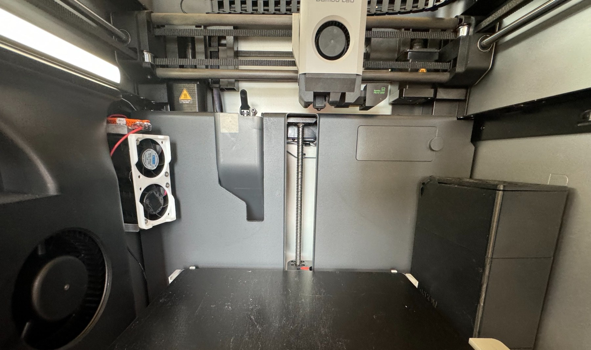
  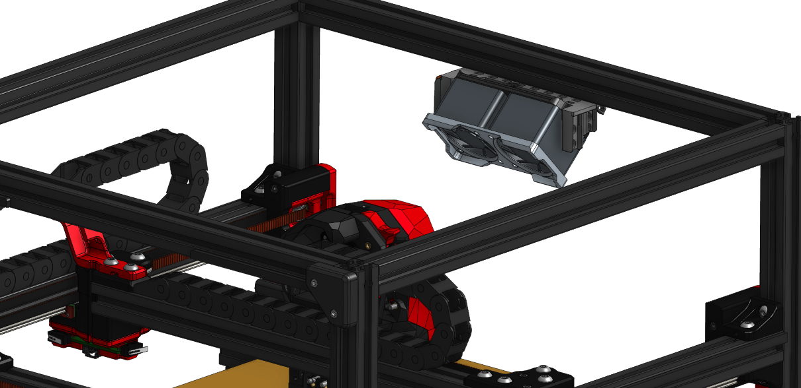

### Printer-specific validation

Every enclosure has different airflow behavior.

Monitor:

* print warping;
* chamber temperature;
* part-adjacent airflow;
* layer adhesion;
* sensor response;
* mounting stability.

Start at a low fan speed and increase airflow only after confirming that print quality is unaffected.

---

## License

ChamberFlux V2 is licensed under the **GNU General Public License v3.0**.

See [`LICENSE`](LICENSE) for the complete license terms.

You may use, study, modify, and redistribute the project subject to the GPLv3 requirements.

---

## Contact and Contributions

Bug reports, printer compatibility reports, feature requests, and design improvements are welcome.

To contribute:

* open a GitHub issue;
* submit a pull request;
* share installation photos and test results;
* provide compatibility information for additional printer models.

GitHub issues:

> [Open an issue](https://github.com/hayoitzmeyo/Chamber_Flux_V2/issues)

Discord:

> `DISCORD_USERNAME_HERE`

When reporting an installation, please include:

* printer model;
* enclosure size;
* filter type;
* fan model and voltage;
* mounting method;
* fan speed;
* installation photos;
* any measured filtration or temperature results.

Feedback from independent installations will help determine how ChamberFlux performs across different printer geometries.
