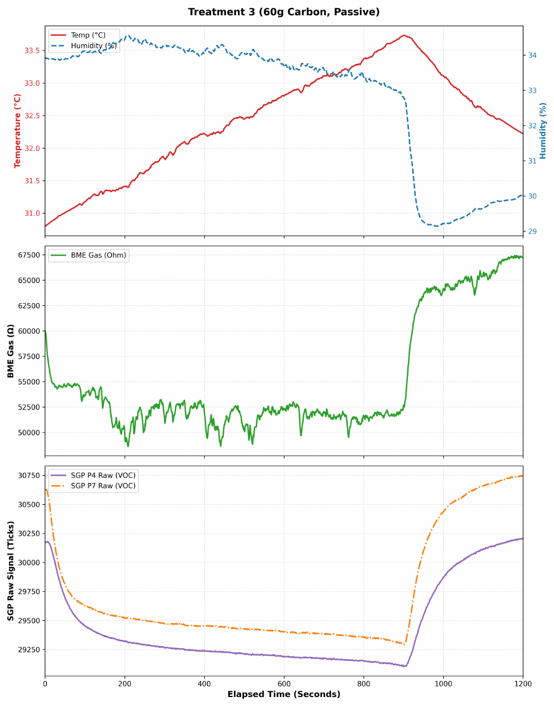
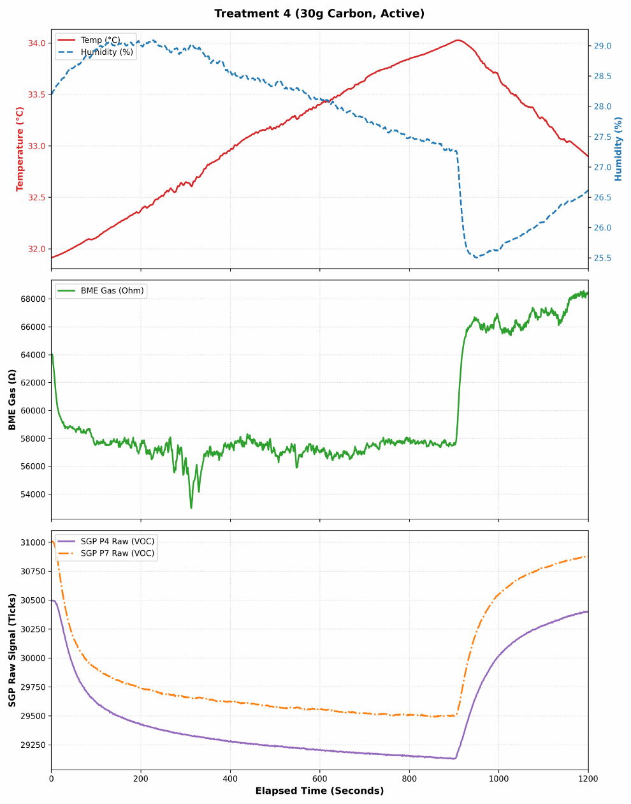

# OpenChamberFlow

**Compact dual-fan chamber recirculation for enclosed FDM printers**

<p align="center">
  
</p>

OpenChamberFlow is a compact, low-restriction recirculation module designed to improve chamber-scale air transport toward an existing activated-carbon filter. It is **not another filter**: it targets stagnant regions and helps contaminated chamber air reach the working area of the filter already installed.

> **Project status:** prototype validated in a controlled test chamber; public beta files and broader printer testing are in progress.

## Why this exists

Compact enclosure filters use fans that must generate static pressure across a sorbent bed. That is useful for forcing air through carbon, but the resulting circulation can remain localized near the filter. OpenChamberFlow adds separate high-flow chamber mixing without adding another carbon cartridge or replacing the existing filter assembly.

## Controlled test result

In an 8 L controlled chamber with four trials per condition, the **30 g carbon + active recirculation** condition produced lower mean comparative VOC-sensor response than the **60 g carbon + passive circulation** condition:

| Metric | 30 g active | 60 g passive |
|---|---:|---:|
| SGP41 response at 900 s | 1.30 ± 0.21 log2-eq | 1.43 ± 0.20 log2-eq |
| Cumulative response, 0-900 s | 15.98 ± 3.14 log2-min | 18.19 ± 3.54 log2-min |

These are comparative metal-oxide sensor measurements from one controlled chamber geometry. They are **not absolute VOC concentrations, a universal performance guarantee, or a safety certification**. See [`data/combinedGasPlots.pdf`](data/combinedGasPlots.pdf) and [`docs/TESTING.md`](docs/TESTING.md).

<p align="center">
  
  
</p>

## Hardware features

- 98 × 40 × 26 mm dual-fan assembly
- Four possible fan pivot locations
- Horizontal, vertical, and inverted mounting support
- VHB strip recess
- Press-fit magnet pockets
- Zip-tie mounting points
- Integrated wire-routing channels and wiring hooks
- Lightweight, support-free print geometry
- Shrinkage-compensated fit
- Compatible with existing enclosure filters; no modification to the carbon bed required

## Photos

<p align="center">
  
  
</p>

<p align="center">
  
</p>

## Repository contents

```text
OpenChamberFlow/
├── README.md
├── CHANGELOG.md
├── CONTRIBUTING.md
├── CITATION.cff
├── LICENSE.md
├── bom/
│   └── BOM.csv
├── data/
│   └── combinedGasPlots.pdf
├── docs/
│   ├── ASSEMBLY.md
│   ├── PLACEMENT.md
│   ├── SAFETY.md
│   └── TESTING.md
├── hardware/
│   ├── 3mf/
│   ├── source/
│   ├── step/
│   └── stl/
└── media/
```

## Required parts

The exact fan and hardware specifications must be finalized before the public release. The draft bill of materials is in [`bom/BOM.csv`](bom/BOM.csv).

## Installation overview

1. Print the mount and pivoting fan carrier.
2. Install both fans in the intended airflow orientation.
3. Route wiring through the integrated paths and strain-relief hooks.
4. Select a pivot location and verify the carrier holds its angle.
5. Attach the base using VHB, magnets, zip ties, or the applicable mechanical mount.
6. Position the module in an upper or corner chamber region without interfering with motion.
7. Aim airflow across the chamber or toward the existing filter intake.
8. Verify that airflow is not directed strongly at the printed part.

See [`docs/ASSEMBLY.md`](docs/ASSEMBLY.md) and [`docs/PLACEMENT.md`](docs/PLACEMENT.md).

## Compatibility

The design is intended for enclosed FDM printers and existing internal filtration systems, including Nevermore-style carbon filters. It is an independent community design and is not endorsed by or affiliated with Nevermore 3D.

Compatibility varies by chamber geometry, available mounting surfaces, fan voltage, and printer motion envelope. Please open an issue with your printer model and installation photos.

## Print guidance

- Print without supports in the supplied orientation.
- Use a material appropriate for the maximum temperature of your printer chamber.
- Verify dimensional fit before applying permanent adhesive.
- Do not place printed parts against hot components or inside the toolhead/bed motion envelope.

Final slicer settings will be documented after beta testing.

## Data and limitations

This project originated from a controlled study of carbon mass and active chamber recirculation. The current evidence supports the importance of chamber-scale transport in the tested setup. It does not establish that every printer, fan arrangement, or filter will produce the same result.

The project should be evaluated using:
- matched passive/active trials,
- identical filament and extrusion conditions,
- multiple repeated trials,
- sensor placement held constant,
- temperature and humidity monitoring,
- transparent reporting of raw and processed data.

## Contributing

Beta testers and contributors are welcome. Useful reports include:

- printer/enclosure model,
- filter type and carbon mass,
- fan model and voltage,
- mounting method and pivot location,
- photos of the installation,
- clearance or fit problems,
- airflow/noise observations,
- comparative sensor data, if available.

Please read [`CONTRIBUTING.md`](CONTRIBUTING.md) before opening an issue or pull request.

## Safety

OpenChamberFlow is an experimental recirculation accessory. It does not make printing emissions safe and is not a substitute for appropriate ventilation, material handling, electrical protection, or manufacturer guidance. Read [`docs/SAFETY.md`](docs/SAFETY.md).

## License

A final hardware license must be selected before public launch. See [`LICENSE.md`](LICENSE.md).
